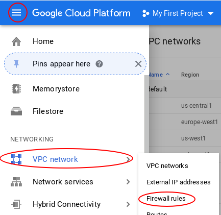
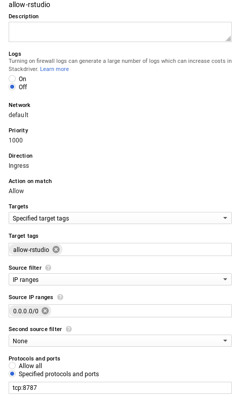

# Warning

* These scripts are tailored to my needs. 
* Sorry, I will not make them more generic of versatile if it does not fit my needs.

# Create network tag for RStudio Server
## Go to firewall rules

## Add a network tag

